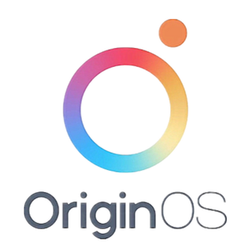

# Android-ROMs

|                          Icon                           |    OEM Name    |     ROM Name      | Development Status | Latest Version |                                           Website                                            |
| :-----------------------------------------------------: | :------------: | :---------------: | :----------------: | :------------: | :------------------------------------------------------------------------------------------: |
|       |  **Asus ROG**  |     **ROGUI**     |       Active       |       14       |                        [Website](https://www.asus.com/in/content/ui/)                        |
|       | **BlackShark** |     **JoyUI**     |       Active       |       13       |                                         [Website]()                                          |
|      | **Blackview**  |    **DokeOS**     |       Active       |       4        |                                         [Website]()                                          |
|     |   **Google**   |    **Android**    |       Active       |       14       |                                         [Website]()                                          |
|        |   **Huawei**   |     **EMUI**      |       Active       |       14       |                                         [Website]()                                          |
|     |    **Htc**     | **Stock Android** |       Active       |       14       |                                         [Website]()                                          |
|         |  **Infinix**   |      **XOS**      |       Active       |       14       |                                         [Website]()                                          |
|     |   **Honor**    |    **MagicOS**    |       Active       |       8        |                                         [Website]()                                          |
|   |   **Meizu**    |   **FlymeAIOS**   |       Active       |       11       |                                         [Website]()                                          |
|     |  **Motorola**  |    **HelloUI**    |       Active       |       14       |                                         [Website]()                                          |
|  |   **Nokia**    |  **Android One**  |       Active       |       14       |                                         [Website]()                                          |
|   |  **Nothing**   |   **NothingOS**   |       Active       |      2.5       |                                         [Website]()                                          |
|         |   **Nubia**    |      **ZOS**      |       Active       |       14       |                                         [Website]()                                          |
|    |  **OnePlus**   |   **OxygenOS**    |       Active       |       14       |                                         [Website]()                                          |
|     |    **Oppo**    |    **ColorOS**    |       Active       |       14       |                                         [Website]()                                          |
|    |   **Realme**   |   **RealmeUI**    |       Active       |       5        |                                         [Website]()                                          |
|  |  **Redmagic**  |  **RedmagicOS**   |       Active       |       14       |                                         [Website]()                                          |
|       |  **Samsung**   |     **OneUI**     |       Active       |      6.1       |                                         [Website]()                                          |
|     |    **Sony**    | **Stock Android** |       Active       |       14       |                                         [Website]()                                          |
|        |   **Techno**   |     **HiOS**      |       Active       |       14       |                                         [Website]()                                          |
|    |    **Vivo**    |   **OriginOS**    |       Active       |       4        |                                         [Website]()                                          |
|  |    **Vivo**    |  **FuntouchOS**   |       Active       |       4        |                                         [Website]()                                          |
|     |   **Xiaomi**   |    **HyperOS**    |       Active       |      1.0       | [Website Global](https://www.mi.com/global/hyperos) [Website China](https://hyperos.mi.com/) |
